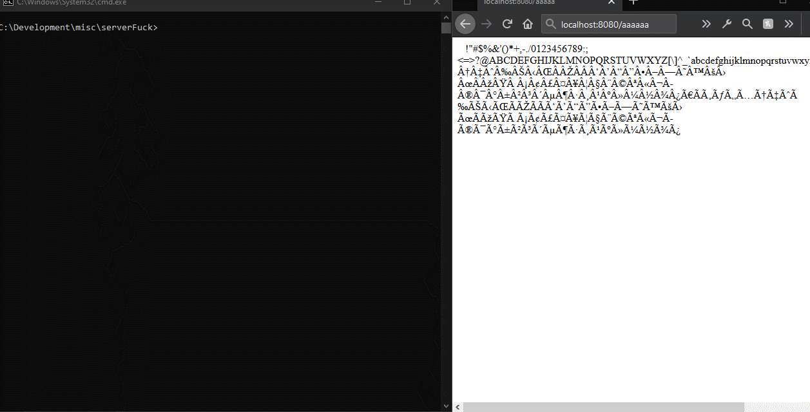
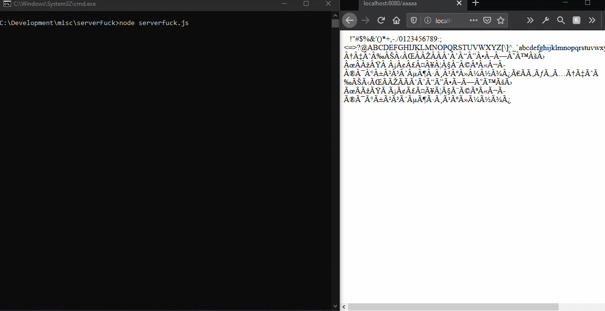

# ServerFuck
BrainFuck for backend development. ~~Yes, really.~~

Is NPM too disorganized for you? Don't like Python? You've come to the *wrong* place my friend, ServerFuck is **far** worse.

ServerFuck uses a language called *BrainFuck*, a programming "language" with only 8 valid characters. You heard that right. In other words, this is a joke program, not meant for actual use. *If* you're determined to prove me wrong, go ahead and make a full webserver with it, post it on twitter and @ me (@lost_eth0).

##### Demo
Here is an example of ServerFuck running with full verbose logging, running a program that displays all ASCII characters.

Heres the same demo, but without verbose logging.

As you can see, logging slows it down a good deal, but helps with debugging a lot.

##### Changes From Standard BrainFuck
ServerFuck is a semi-faithful implementation of BrainFuck, making only two subtle changes to make sense (if you can call it that) as a backend.
  - `.` Outputs text to the end user rather than on the command line.
  - `,` Gets the URL that the user sent, character by character, rather than whatever key is pressed.

##### Running
Download or clone the repository and then run:
```
node serverfuck.js
```
(Assuming you have Node.js installed)

To change which file is used to run the server, simply change the onRequest field in `config.json`.
